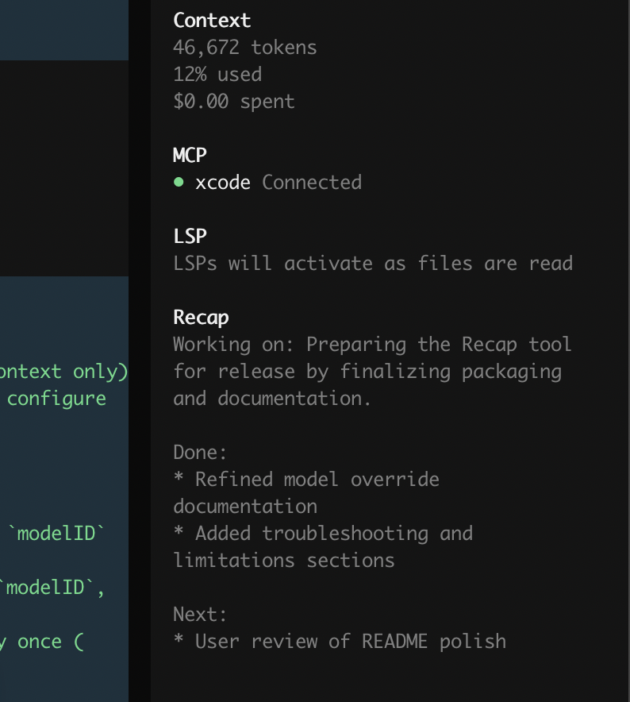

# opencode-recap

Sidebar recap plugin for [OpenCode](https://opencode.ai).

- Click **Recap** to generate a short Markdown summary
- Renders in the sidebar (not the chat thread)
- Auto-clears after 3 new prompts



## Install

```sh
opencode plugin @streetturtle/opencode-recap
```

Global install:

```sh
opencode plugin --global @streetturtle/opencode-recap
```

Restart OpenCode after install.

## Usage

Open a session and click **Recap** in the sidebar.

- Uses recent context (last 10 messages)
- Reuses previous recap for continuity
- Default model: the session's recent assistant model

## Optional model override

Set both `providerID` and `modelID` in `tui.json`:

```json
{
  "plugin": [
    ["@streetturtle/opencode-recap", {
      "providerID": "github-copilot",
      "modelID": "gemini-3-flash-preview"
    }]
  ]
}
```

## Troubleshooting

- `ProviderModelNotFoundError`: verify values with `opencode models`
- `Invalid recap plugin config`: set both fields or neither
- `duplicate tui plugin id`: configure recap in only one `tui.json`

## Requirements

- OpenCode 1.4.3+
- Any configured AI provider
